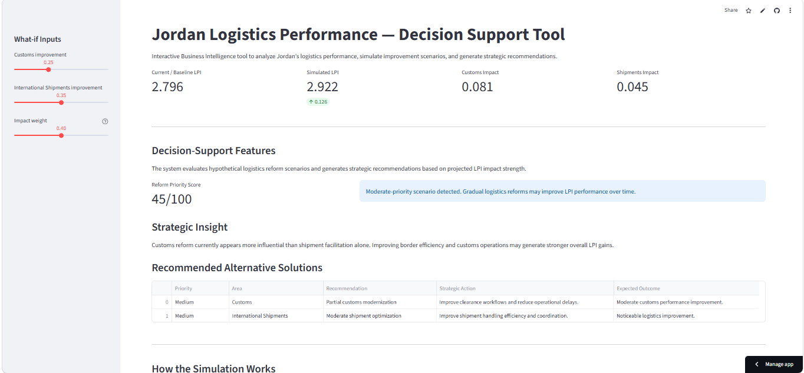
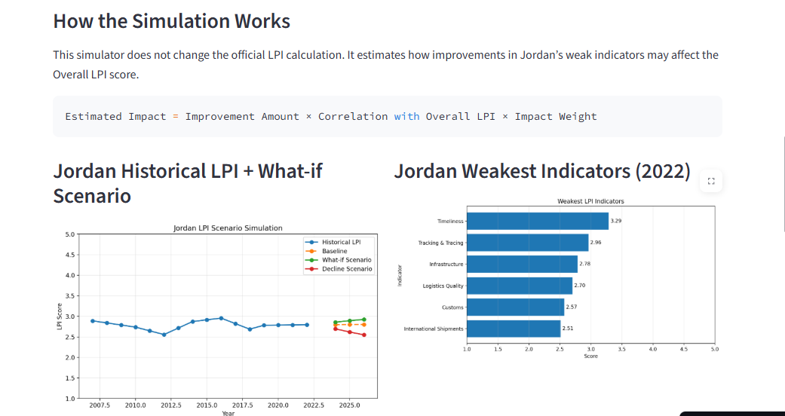
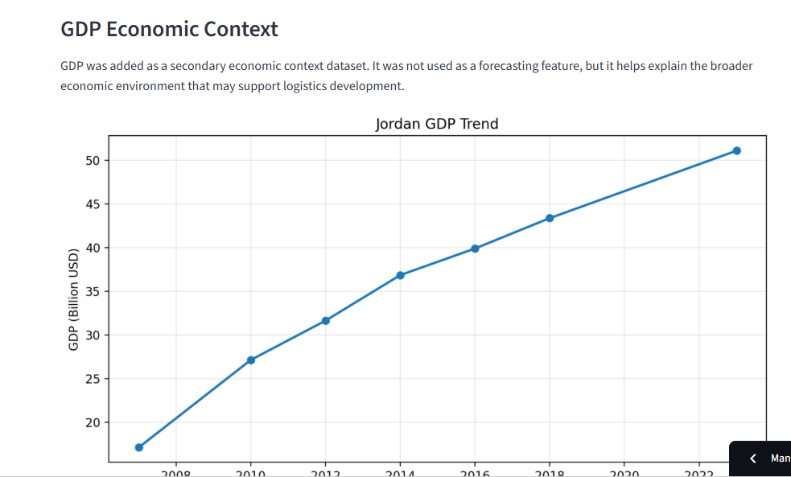
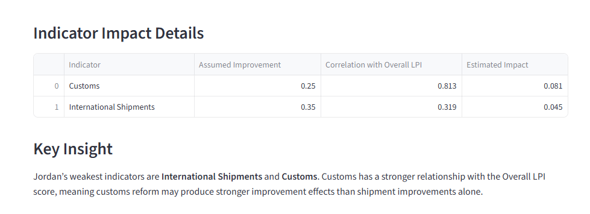
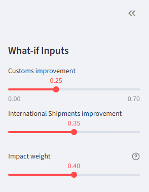

````md
# Jordan Logistics Performance — Decision Support Tool

Interactive Business Intelligence and analytics project focused on analyzing Jordan’s Logistics Performance Index (LPI), forecasting logistics trends, and simulating improvement scenarios using Business Intelligence and advanced analytics techniques.

---

## Project Overview

This project was developed as a Business Intelligence graduation project at the University of Petra.

The system combines:

- Power BI dashboards and business reporting
- Python-based analytics
- Data preprocessing and interpolation
- Clustering analysis
- Forecasting analysis
- What-if scenario simulation
- Decision-support features
- Streamlit interactive deployment

The project aims to support data-driven logistics decision-making by analyzing Jordan’s logistics performance and evaluating possible reform scenarios.

---

## Business Problem

Jordan’s logistics performance contains multiple operational and infrastructure challenges that affect supply-chain efficiency and international competitiveness.

This project attempts to:

- Identify weak logistics indicators
- Analyze historical LPI performance
- Forecast future logistics trends
- Simulate improvement scenarios
- Estimate indicator impact on overall LPI
- Generate strategic logistics recommendations

---

## Technologies Used

### Business Intelligence & Visualization
- Power BI
- Streamlit

### Data Analysis & Machine Learning
- Python
- Pandas
- NumPy
- Scikit-learn
- Matplotlib

### Workflow & Data Preparation
- KNIME

### Deployment & Version Control
- GitHub
- Streamlit Community Cloud

---

## Power BI Dashboard

Power BI was used to create traditional Business Intelligence dashboards and business-oriented visual analytics.

The Power BI phase focused on:
- KPI reporting
- trend visualization
- indicator comparison
- business dashboarding
- executive-style reporting

---

## Streamlit Decision-Support Application

The Streamlit application extends the project into an interactive simulation and decision-support environment.

Main features include:

- Historical LPI trend analysis
- Weak indicator detection
- Correlation-based impact estimation
- What-if scenario simulation
- Rule-based recommendation engine
- Reform priority scoring
- GDP economic context integration
- Interactive dashboard visualization

### Live Application

https://gpbi20252-gqcxmgnwreelog4izl8syj.streamlit.app/

---

## Project Documentation

| Section | Description |
|---|---|
| `docs/01_project_description.md` | Project objectives and business problem |
| `docs/02_data_research.md` | Data collection and research process |
| `docs/03_data_preprocessing.md` | Data cleaning and preprocessing |
| `docs/04_exploratory_data_analysis.md` | Exploratory data analysis |
| `docs/05_clustering_analysis.md` | Clustering methodology and findings |
| `docs/06_forecasting_analysis.md` | Forecasting process and interpretation |
| `docs/07_what_if_analysis.md` | What-if simulation logic |
| `docs/08_streamlit_application.md` | Streamlit application explanation |
| `docs/09_project_architecture.md` | Overall system architecture |
| `docs/10_limitations_and_future_work.md` | Limitations and future improvements |

---

## Project Structure

```text
GP_BI20252/
│
├── data/                  # Raw datasets
├── docs/                  # Project documentation
├── images/                # Dashboard screenshots
├── knime/                 # KNIME workflows
├── outputs/               # Processed datasets and outputs
│
├── 01_cleaning.py
├── 01b_interpolation.py
├── 02_outliers.py
├── 02a_eda.py
├── 02b_pattern.py
├── 02c_clustering.py
├── 02d_clustering_by_year.py
├── 03_forecasting.py
├── 03b_evaluation.py
├── 04_whatif.py
├── app.py
│
├── requirements.txt
└── README.md
````

---

# Dashboard Preview

## Main Dashboard



## Decision-Support Features


## What-if Simulation



## GDP Economic Context



## Indicator Impact Details



## Sidebar Inputs



---

## Key Insights

* Customs and International Shipments were identified as Jordan’s weakest logistics indicators.
* Customs reform showed stronger correlation with overall LPI improvement.
* Scenario simulation demonstrated how targeted logistics reforms may improve projected logistics performance.
* GDP was integrated as supporting economic context rather than a direct forecasting feature.

---

## Deployment

The project was deployed using:

* GitHub
* Streamlit Community Cloud

Deployment supports:

* interactive scenario simulation
* cloud-based dashboard access
* public project sharing
* reproducible analytics workflows

---

## Authors

Business Intelligence Graduation Project
University of Petra — 2025/2026

---

## References

* World Bank Logistics Performance Index (LPI)
* World Bank Open Data
* Streamlit Documentation
* Power BI Documentation
* Scikit-learn Documentation

```
```
