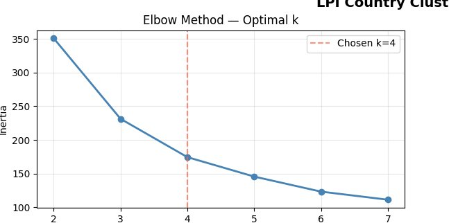
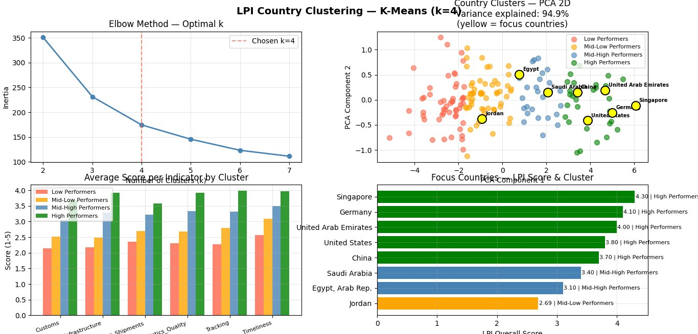
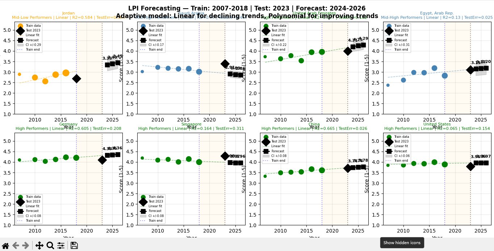
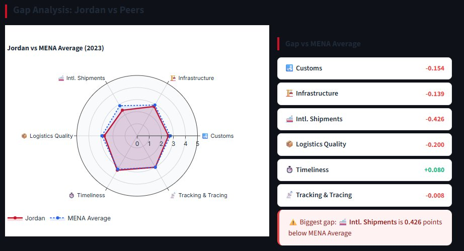
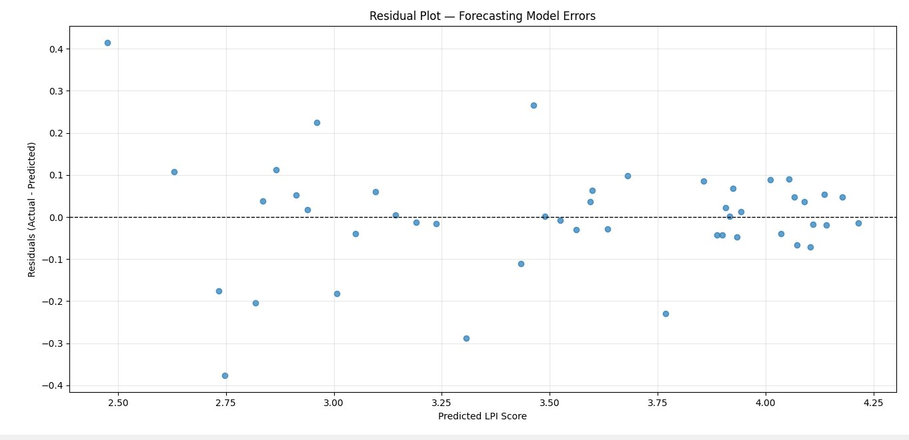
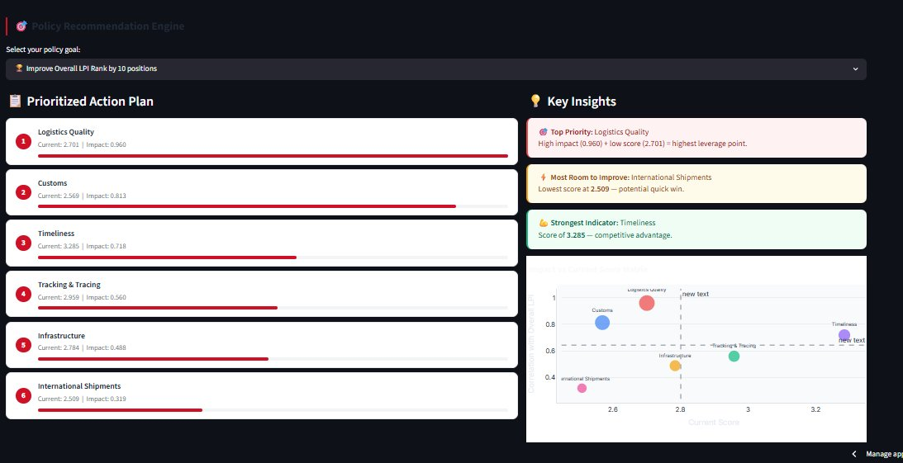
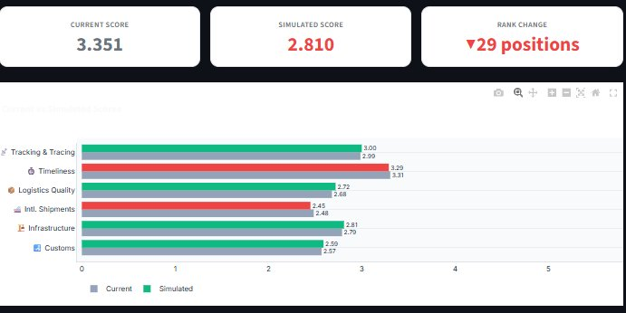
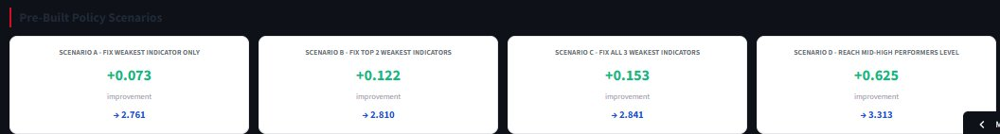

# Jordan Logistics Performance Index (LPI) Decision Support System

## Graduation Project Documentation

| | |
|---|---|
| **Student Name** | Haya AlKurdi |
| **University** | University of Petra |
| **Department** | Business Intelligence and Data Analytics |
| **Project Type** | Data Analytics, Forecasting, and Decision Support System |
| **Submission Date** | 3 / 6 / 2026 |
| **Supervisor** | Dr.Hussam Barham |
web app link :                          https://gpbi20252-uznbgc3kzaewsofzqnjxnn.streamlit.app
---

## Table of Contents

1. [Project Introduction](#1-project-introduction)
2. [Business Understanding](#2-business-understanding)
3. [Dataset](#3-dataset)
4. [AI Part](#4-ai-part)
5. [Code Explanation](#5-code-explanation)
6. [Results](#6-results)
7. [Performance Measurements](#7-performance-measurements)
8. [Flowchart](#8-flowchart)
9. [Block Diagram](#9-block-diagram)
10. [Challenges and Solutions](#10-challenges-and-solutions)
11. [Future Work](#11-future-work)
12. [Conclusion](#12-conclusion)
13. [References](#13-references)

---

## 1. Project Introduction


### 1.1 Project Idea

This project focuses on analyzing Jordan's Logistics Performance Index (LPI) using historical data obtained from the World Bank. The project applies data analytics and machine learning techniques to evaluate Jordan's logistics performance, identify strengths and weaknesses, compare Jordan with other countries and regions, and predict future performance trends.

The project includes data preprocessing, exploratory data analysis (EDA), clustering analysis, forecasting, gap analysis, what-if scenario simulation, and recommendation generation. These components work together to provide a comprehensive understanding of Jordan's logistics performance and support data-driven decision-making.

To enhance usability and accessibility, an interactive Streamlit web application was developed to visualize the results, explore different scenarios, and present insights through dashboards, forecasts, comparisons, and strategic recommendations.

### 1.2 Problem Statement

The Logistics Performance Index (LPI) is one of the most important global indicators used to evaluate logistics efficiency and supply chain performance. However, the index consists of multiple indicators collected over different years, making it difficult to understand overall performance trends and identify the factors that have the greatest impact on a country's logistics performance.

For Jordan, analyzing individual LPI indicators separately does not provide a complete picture of logistics performance. Stakeholders need a way to understand historical trends, compare Jordan with other countries, identify performance gaps, predict future outcomes, and evaluate the potential impact of improving specific indicators.

Therefore, there is a need for an analytical framework that transforms LPI data into meaningful insights and supports the evaluation of current performance, future forecasts, and improvement opportunities.

### 1.3 Project Importance


The importance of this project is that it helps identify Jordan's logistics strengths and weaknesses using data-driven methods. Instead of relying only on static reports, the system provides interactive visualizations, forecasting results, gap analysis, and policy improvement scenarios.

### 1.4 Project Objectives

The main objectives of this project are:

- Analyze Jordan's historical LPI performance.
- Compare Jordan with global and regional benchmarks.
- Classify countries into logistics performance clusters.
- Forecast Jordan's LPI performance for future years.
- Identify gaps between Jordan and peer countries.
- Simulate what-if improvement scenarios.
- Provide decision-support recommendations.
- Build an interactive Streamlit application.
- Integrate World Bank API to support updated data retrieval.

---

## 2. Business Understanding

### 2.1 Target Users

The target users of this system are:

- Jordanian policymakers.
- Ministry of Transport.
- Jordan Customs Department                                

- Economic planning institutions.                               
- Logistics and supply chain stakeholders.
- Researchers interested in logistics performance.        

### 2.2 Business Story

Jordan's logistics performance is an important factor in trade efficiency and economic competitiveness. The Logistics Performance Index provides a global measure of logistics quality, but the raw data alone does not directly show decision-makers what actions should be prioritized.

This project builds a Decision Support System that answers important questions such as:

- Where does Jordan stand compared to other countries?
- Which logistics indicators are the weakest?
- Which indicators have the highest impact on the overall LPI score?
- What is the expected future performance?
- What would happen if specific indicators improved?

By answering these questions, the system supports strategic planning and helps decision-makers identify the most important areas for improvement.

### 2.3 Analytical Components

The project consists of several analytical components that work together to provide a comprehensive evaluation of Jordan's logistics performance.

- **Exploratory Data Analysis (EDA)** was used to understand historical trends and identify patterns within the LPI data.
- **Clustering Analysis** was applied to group countries with similar logistics performance levels and determine Jordan's relative position among them.
- **Forecasting Models** were developed to estimate future LPI performance and analyze potential trends for the coming years.
- **Gap Analysis** was used to identify differences between Jordan's performance and benchmark countries or regional averages.
- **What-If Analysis** was implemented to evaluate the potential impact of improving specific logistics indicators on the overall LPI score.
- **A Recommendation Engine** was developed to prioritize indicators that require improvement and support evidence-based decision-making.
- **An interactive Streamlit application** was created to visualize the analytical results and provide an accessible interface for exploring insights.

---

## 3. Dataset

### 3.1 Data Source

The dataset was obtained from the World Bank Logistics Performance Index (LPI) database.

**Source:** https://data.worldbank.org/indicator/LP.LPI.OVRL.XQ

### 3.2 Dataset Size

The final cleaned dataset contains:

- 22,610 rows
- 9 columns
- 168 countries
- Years covered: 2007, 2010, 2012, 2014, 2016, 2018, and 2023

### 3.3 Type of Data

The dataset used in this project is a structured panel dataset obtained from the World Bank Logistics Performance Index (LPI).

It combines:

- **Cross-Country Data**, as it contains logistics performance measurements for 168 countries.
- **Time-Series Data**, as observations are recorded across multiple years.
- **Numerical Data**, as the primary variables represent quantitative LPI indicator scores.

Because multiple countries are observed repeatedly over different years, the dataset can be classified as a **panel dataset**.

### 3.4 Dataset Features

| Column Name | Description |
|---|---|
| Country Code | Country identifier |
| Country Name | Country name |
| Region | Geographic region |
| Income Group | Income classification |
| Indicator Code | Indicator identifier |
| Indicator Short | Short indicator name |
| Indicator Type | LPI indicator category |
| Year | Observation year |
| Value | Indicator score |

### 3.5 Data Issues

Several challenges were identified in the original dataset before the analysis phase:

- Missing values across multiple countries, indicators, and years.
- Large gaps between survey years because the LPI is not published annually.
- A significant five-year gap between 2018 and 2023.
- The original dataset was not structured in an analysis-ready format, as years were stored as separate columns.
- Variations in data availability across countries and indicators.

### 3.6 Data Cleaning

Several preprocessing steps were performed to prepare the dataset for analysis:

- Converted the dataset from wide format to long format using the `melt()` function.
- Converted year values into a single `Year` column.
- Converted indicator values into numerical format.
- Removed duplicate records.
- Merged country information such as `Region` and `Income Group`.
- Created indicator labels and indicator types.
- Reorganized the dataset into a structured format suitable for analysis.

These steps improved data consistency and prepared the dataset for forecasting, clustering, and visualization tasks.

### 3.7 Missing Value Treatment

The dataset contained missing values across several countries, indicators, and years. A detailed missing value analysis was performed before applying any analytical models.

To address missing observations:

- Small gaps between historical years were filled using **Linear Interpolation**.
- For the larger gap between 2018 and 2023, a **hybrid forecasting approach** was used.
- Historical trends were preserved while avoiding unrealistic jumps in indicator values.

This approach allowed the project to maintain data continuity while minimizing distortion of the original observations.

### 3.8 Removing Unnecessary Data

Several attributes were removed during preprocessing because they were not required for forecasting, clustering, or visualization tasks. Examples include redundant descriptive fields that duplicated existing information already represented by other attributes. Removing unnecessary fields reduced dataset complexity and improved processing efficiency.

### 3.9 Encoding

Encoding was not required in this project because the analytical models were based primarily on numerical LPI indicator values. The project did not involve categorical classification tasks that required Label Encoding or One-Hot Encoding.

### 3.10 Normalization / Standardization

Standardization was applied before the clustering stage because K-Means clustering is sensitive to feature scales. The `StandardScaler` technique from Scikit-Learn was used to standardize logistics indicators before training the clustering model. This ensured that all indicators contributed fairly to the clustering process.

### 3.11 Train/Test Split

The forecasting model was trained using historical observations from 2007 to 2018. The year 2023 was reserved as a testing period to evaluate forecasting accuracy before generating future predictions.

| Split | Period |
|---|---|
| Training Data | 2007–2018 |
| Testing Data | 2023 |
| Forecast Horizon | 2024–2026 |

This approach allowed the model to be evaluated on unseen data before producing future forecasts.

---

## 4. AI Part

### 4.1 Overview of Analytical Models

This project combines multiple analytical and machine learning techniques to evaluate Jordan's logistics performance and generate data-driven insights. The main analytical models used in this project are:

- K-Means Clustering
- Linear Regression
- Polynomial Regression
- What-If Analysis
- Recommendation Engine

These models work together to analyze historical LPI data, identify performance patterns, forecast future outcomes, and evaluate potential improvement scenarios.

---

### 4.2 Clustering Analysis

**Algorithm Used:** K-Means Clustering was used to group countries with similar logistics performance levels based on their Logistics Performance Index (LPI) indicators.

**Why K-Means?** K-Means was selected because it is one of the most widely used unsupervised machine learning algorithms for identifying patterns and grouping similar observations.

**Features Used:**
- Customs
- Infrastructure
- International Shipments
- Logistics Quality and Competence
- Tracking and Tracing
- Timeliness
- Overall LPI Score

**Training Process:** Countries were grouped into four clusters:
- Low Performers
- Mid-Low Performers
- Mid-High Performers
- High Performers

**Model Evaluation:** The Elbow Method and Silhouette Score were used to evaluate clustering quality.

<br>



*Figure 4.1: Elbow Method Used to Determine the Optimal Number of Clusters.*

<br>



*Figure 4.2: Country Clustering Results Using K-Means and PCA Visualization.*

---

### 4.3 Forecasting Analysis

**Forecasting Objective:** The forecasting component was developed to estimate Jordan's future Logistics Performance Index (LPI) scores for 2024–2026.

**Algorithms Used:**
- Linear Regression
- Polynomial Regression

**Why These Algorithms?** Linear Regression provides interpretable long-term trends, while Polynomial Regression captures non-linear behavior in logistics performance.

**Training Process:**
- Training Data: 2007–2018
- Testing Data: 2023

**Forecast Results:** Forecasts were generated for 2024, 2025, and 2026.

<br>



*Figure 4.3: Historical and Forecasted LPI Performance for Jordan (2024–2026).*

---

### 4.4 Gap Analysis

Gap Analysis was performed to compare Jordan's logistics performance against benchmark groups. The primary benchmark used was the MENA regional average.

The analysis focused on:
- Customs
- Infrastructure
- International Shipments
- Logistics Quality and Competence
- Tracking and Tracing
- Timeliness

<br>



*Figure 4.4: Jordan Compared with the MENA Average Across LPI Indicators.*

---

### 4.5 What-If Analysis

The What-If Analysis module was developed to evaluate the impact of improving selected logistics indicators. The simulation enables users to test alternative scenarios and estimate their effect on Jordan's overall LPI performance.

<br>



*Figure 4.5: What-If Analysis Interface Showing Simulated LPI Performance and Rank Impact.*

---

### 4.6 Recommendation Engine

Recommendations were generated using:
- Clustering Results
- Forecasting Results
- Gap Analysis Results
- What-If Analysis Results

The system identifies the indicators that should be prioritized for improvement.

<br>



*Figure 4.6: Policy Recommendation Engine and Prioritized Improvement Actions.*

---

### 4.7 Libraries and Tools Used

| Tool / Library | Purpose |
|---|---|
| Pandas | Data cleaning and manipulation |
| NumPy | Numerical calculations |
| Scikit-Learn | Clustering, forecasting, and preprocessing |
| Matplotlib | Data visualization |
| Streamlit | Interactive web application |
| World Bank API | Data retrieval and updates |
| GitHub | Version control and project management |

---

## 5. Code Explanation

### 5.1 Data Cleaning Code

The purpose of this module is to transform the original World Bank Logistics Performance Index dataset into a structured and analysis-ready format.

```python
df_melted = df_data.melt(
    id_vars=['Country Name','Country Code',
             'Indicator Name','Indicator Code'],
    value_vars=YEAR_COLS,
    var_name='Year',
    value_name='Value'
)

df_melted['Year'] = df_melted['Year'].astype(int)
df_melted['Value'] = pd.to_numeric(df_melted['Value'], errors='coerce')
```

This code converts the dataset from wide format into long format and prepares it for analysis.

---

### 5.2 Missing Value Treatment Code

```python
if (y_after - y_before) <= 4:
    ratio = (year - y_before) / (y_after - y_before)
    value = v_before + ratio * (v_after - v_before)
```

This code applies linear interpolation for small gaps between survey years.

```python
pred_lin = lin_model.predict(np.array([[year]]))[0]
pred_poly = poly_model.predict(np.array([[year]]))[0]

pred = 0.85 * pred_lin + 0.15 * pred_poly
pred = np.clip(pred, 1.0, 5.0)
```

This code estimates values in the large 2018–2023 gap using a hybrid forecasting approach.

---

### 5.3 Clustering Code

```python
scaler = StandardScaler()
X_scaled = scaler.fit_transform(df_latest[FEATURES])
```

This code standardizes the selected indicators before clustering.

```python
kmeans = KMeans(
    n_clusters=4,
    random_state=42,
    n_init=10
)

df_latest['Cluster'] = kmeans.fit_predict(X_scaled)
```

This code assigns each country to a logistics performance cluster.

```python
sil_score = silhouette_score(
    X_scaled,
    df_latest['Cluster']
)
```

This code evaluates clustering quality using the Silhouette Score.

---

### 5.4 Forecasting Code

The forecasting module predicts Jordan's future logistics performance for the years 2024–2026.

```python
train_mask = years <= 2018
test_mask = years == 2023
```

This code separates the historical data into training and testing periods.

```python
m_lin = LinearRegression()
m_lin.fit(X_train, y_train, sample_weight=w_train)
```

This code trains the Linear Regression model using weighted observations.

```python
poly = PolynomialFeatures(degree=2)
X_tr_p = poly.fit_transform(X_train)

m_poly = LinearRegression()
m_poly.fit(X_tr_p, y_train, sample_weight=w_train)
```

This code trains the Polynomial Regression model to capture non-linear trends.

```python
err_lin = abs(m_lin.predict(X_test)[0] - y_test[0])
err_poly = abs(m_poly.predict(X_te_p)[0] - y_test[0])
```

This code compares forecasting errors and helps select the most suitable model.

---

### 5.5 What-If Analysis Code

This module evaluates the impact of improving weak logistics indicators on Jordan's overall LPI performance.

```python
indicator_ranking = latest_indicators[
    ['Indicator Code', 'Indicator Name', 'Value']
].sort_values('Value')
```

This code ranks Jordan's logistics indicators from weakest to strongest.

```python
corr = pivot[overall_indicator].corr(pivot[ind])
```

This code estimates the relationship between each logistics indicator and the overall LPI score.

```python
impact_worst_1 = improve_worst_1 * corr_1 * impact_weight
impact_worst_2 = improve_worst_2 * corr_2 * impact_weight

scenario_combined = baseline + impact_worst_1 + impact_worst_2
```

This code simulates the impact of improving weak indicators on Jordan's overall logistics performance.

---

### 5.6 Streamlit Application Code

The Streamlit application serves as the interactive user interface of the project.

```python
tab1, tab2, tab3, tab4, tab5, tab6, tab7 = st.tabs([
    "📍 Cluster Position",
    "🔍 Gap Analysis",
    "🔮 What-If Simulator",
    "📈 Trend & Forecast",
    "🎯 DSS Recommendations",
    "💬 Ask the Data",
    "🌐 Live World Bank Data",
])
```
 ### 5.7 Live Streamlit Application
 [Open Streamlit Dashboard]   https://gpbi20252-uznbgc3kzaewsofzqnjxnn.streamlit.app

This code creates the main navigation tabs used throughout the dashboard.

```python
if WB_API_AVAILABLE:
    if st.button("🔄 Fetch Latest from World Bank"):
        live = fetch_jordan_latest()
```

This code connects the dashboard to the World Bank API and allows users to retrieve updated logistics data when available.

---

## 6. Results

This section presents the main findings obtained from clustering, forecasting, gap analysis, what-if analysis, and recommendation generation.

### 6.1 Clustering Results

The K-Means clustering model successfully grouped countries into four logistics performance categories: High Performers, Mid-High Performers, Mid-Low Performers, and Low Performers. Jordan was assigned to a cluster based on its logistics indicators and overall LPI score.

<br>


*Figure 6.1: Elbow Method Used for Selecting the Optimal Number of Clusters.*

<br>


*Figure 6.2: Country Clustering Results Using K-Means.*

---

### 6.2 Forecasting Results

Forecasting models were developed to estimate Jordan's future logistics performance for the years 2024–2026. The forecasting results provide an estimate of future logistics performance based on historical trends and observed patterns.

<br>


*Figure 6.3: Historical and Forecasted LPI Performance for Jordan.*

---

### 6.3 Gap Analysis Results

Gap Analysis was performed to compare Jordan's logistics performance with benchmark countries and regional averages. The analysis identified performance differences across the six LPI indicators and highlighted the areas requiring improvement.

<br>


*Figure 6.4: Gap Analysis Dashboard Comparing Jordan with the MENA Average.*

The radar chart reveals that Jordan performs below the MENA average across most LPI indicators. The most critical performance gap is observed in **International Shipments**, where Jordan scores 0.426 points below the regional average. **Logistics Quality and Competence** follows with a gap of 0.200 points, while **Customs** and **Infrastructure** show gaps of 0.154 and 0.139 respectively. **Tracking and Tracing** shows a minimal gap of 0.008 points. Notably, Jordan outperforms the MENA average in **Timeliness** by 0.080 points, representing the only indicator where Jordan holds a competitive advantage over the regional benchmark.

---

### 6.4 What-If Analysis Results

Several improvement scenarios were simulated to estimate their impact on Jordan's future logistics performance. The analysis demonstrated that targeted improvements in weak indicators can positively influence the overall LPI score.

<br>


*Figure 6.6: Impact of Indicator Adjustments on Jordan's Overall LPI Score.*

The What-If simulator allows users to adjust individual logistics indicators and observe the resulting change in Jordan's overall LPI score. In the scenario shown above, adjustments to key indicators such as Customs, Infrastructure, and International Shipments resulted in a simulated score of **2.810**, compared to the current baseline of **3.351**. The rank change visualization highlights the sensitivity of Jordan's overall performance to improvements in targeted indicators.

<br>



*Figure 6.7: Pre-Built Policy Scenarios and Expected Logistics Performance Improvements.*

The pre-built scenario analysis presents four standardized improvement pathways. **Scenario A**, which focuses on fixing the single weakest indicator, yields an improvement of **+0.073** points, bringing the overall score to 2.761. **Scenario B**, targeting the top two weakest indicators, produces an improvement of **+0.122** points with a resulting score of 2.810. **Scenario C**, which addresses all three weakest indicators simultaneously, achieves a gain of **+0.153** points and a score of 2.841. The most ambitious pathway, **Scenario D**, targets the Mid-High Performers benchmark level and projects a substantial improvement of **+0.625** points, bringing Jordan's forecasted score to **3.313**.

---

### 6.5 Recommendation Results

The recommendation engine identified indicators that require the highest priority for improvement. The generated recommendations provide a practical roadmap for improving Jordan's logistics performance.

<br>


*Figure 6.8: Recommendation Engine Results and Priority Ranking of Logistics Indicators.*

The Policy Recommendation Engine ranks logistics indicators based on a combination of current performance scores and their estimated impact on the overall LPI. **Logistics Quality** is identified as the top priority, with the highest impact score of 0.960 and a current score of 2.701, making it the highest leverage point for improvement. **Customs** ranks second with an impact of 0.813, followed by **Timeliness** at 0.718. Tracking and Tracing, Infrastructure, and International Shipments follow in descending order of priority. The key insights panel further highlights that **International Shipments**, with the lowest score of 2.509, represents the indicator with the most room for improvement, while **Timeliness** at 3.285 serves as Jordan's strongest competitive advantage.

---

## 7. Performance Measurements

The project does not involve a classification task; therefore, classification metrics such as Accuracy, Precision, Recall, F1-Score, ROC Curve, and Confusion Matrix were not applicable. Instead, forecasting performance was evaluated using regression metrics.

### 7.1 Forecasting Evaluation Metrics

The following metrics were used:

| Metric | Description |
|---|---|
| R² Score | Measures how well the forecasting model explains the variation in historical LPI values |
| RMSE | Measures the average magnitude of prediction errors |
| MAE | Measures the average absolute difference between predicted and actual values |
| Test Error | Calculated by comparing predicted values with actual observations from 2023 |

### 7.2 Clustering Evaluation

The clustering model was evaluated using:
- Elbow Method
- Silhouette Score

<br>



*Figure 7.2: Residual Plot for Forecasting Model Errors.*

---

## 8. Flowchart

```
Start
  ↓
Collect World Bank LPI Data
  ↓
Data Cleaning and Preprocessing
  ↓
Missing Value Treatment
  ↓
EDA
  ↓
K-Means Clustering
  ↓
Forecasting Models
  ↓
Gap Analysis
  ↓
What-If Analysis
  ↓
Recommendation Generation
  ↓
Streamlit Dashboard
  ↓
End
```

---

## 9. Block Diagram

```
World Bank Dataset
        ↓
Data Processing Layer
        ↓
    Analytical Layer
  ┌──────────────────────────────────────┐
  │  Clustering  │  Forecasting          │
  │  Gap Analysis  │  What-If Analysis   │
  └──────────────────────────────────────┘
        ↓
Decision Support Layer
        ↓
Visualization Layer
        ↓
    End User
```

---

## 10. Challenges and Solutions

Several challenges were encountered during the project:

| Challenge | Solution |
|---|---|
| Missing values across countries and indicators | Linear interpolation and hybrid forecasting |
| Large data gap between 2018 and 2023 | Hybrid model combining Linear and Polynomial Regression |
| Selecting an appropriate forecasting model | Model comparison using RMSE, MAE, and R² Score |
| Integrating multiple analytical modules into one dashboard | Streamlit multi-tab architecture |

---

## 11. Future Work

Future improvements may include:

- Incorporating additional logistics-related datasets.
- Expanding forecasting horizons beyond 2026.
- Developing advanced machine learning forecasting models.
- Deploying the Streamlit application online.
- Adding real-time logistics indicators from external sources.

---

## 12. Conclusion

This project developed an interactive Logistics Performance Index (LPI) Decision Support System for Jordan using World Bank data. The system integrates data preprocessing, clustering, forecasting, gap analysis, what-if analysis, and recommendation generation within a unified Streamlit dashboard.

The results provide valuable insights into Jordan's logistics performance, identify areas requiring improvement, and support evidence-based decision-making. Overall, the project demonstrates how data analytics and machine learning techniques can be used to support logistics planning and strategic decision-making.

---

## 13. References

1. World Bank. Logistics Performance Index (LPI). https://lpi.worldbank.org
2. World Bank Data API. https://datahelpdesk.worldbank.org
3. Scikit-Learn Documentation. https://scikit-learn.org
4. Streamlit Documentation. https://docs.streamlit.io
5. Pandas Documentation. https://pandas.pydata.org
6. NumPy Documentation. https://numpy.org
7. Matplotlib Documentation. https://matplotlib.org
8. Python Software Foundation. https://www.python.org
